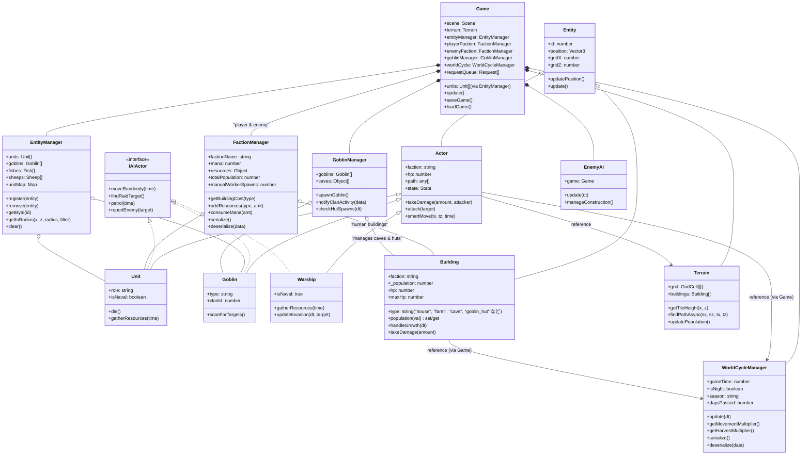

# クラス設計図（FactionManager導入後）

## クラス図 (Mermaid)

## 設計のポイント

1.  **FactionManager の導入**: リソース（マナ、食料）、人口、建築コストの計算を派閥ごとに独立させました。
2.  **WorldCycleManager の導入**: 時間、昼夜、季節、天候の管理を独立させ、移動速度や収穫効率への環境補正を一元化しました。
3.  **Game クラスの責任分散**: グローバルなリソース管理を `FactionManager` に、環境管理を `WorldCycleManager` に委譲し、`Game` クラスの肥大化を抑制しました。
4.  **ゴブリンの管理**: ゴブリンユニットおよびゴブリンの建築物（洞窟、小屋）は `GoblinManager` によって制御されます。これらは `Building` クラスとして実装されていますが、`FactionManager` ではなく `GoblinManager` がその論理的なライフサイクル（スポーン、波の管理など）を担います。
5.  **EntityManager の導入**: エンティティ（ユニット、ゴブリン、動物）の管理を `EntityManager` に一元化しました。ID による高速検索や空間クエリの基盤を提供し、`Game` クラスや `GoblinManager` からの責務を分離しました。
6.  **後方互換性**: `Game.ts` や `GoblinManager.js` にゲッター/セッターを配置し、既存のコードやテストが `game.units` や `gm.goblins` に直接アクセスしても動作するように維持しています。
7.  **セーブデータ互換性**: エンティティの復元ロジックを `EntityManager` 経由に整理しつつ、以前のセーブデータ形式との互換性を保っています。
