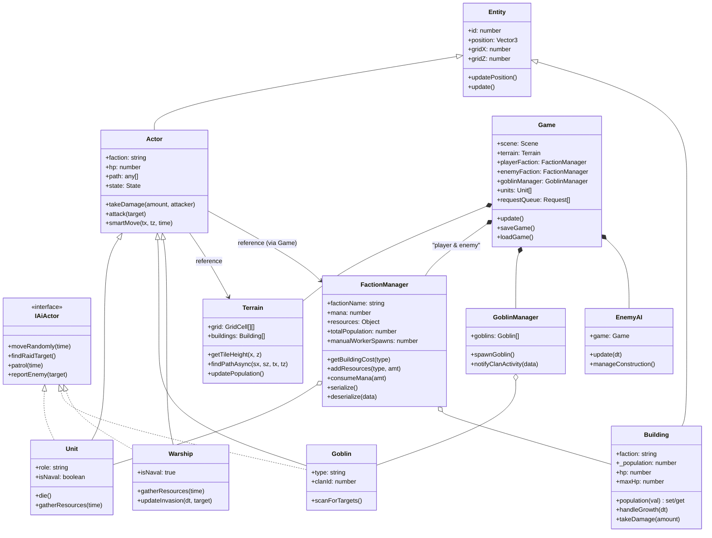

# クラス設計図（FactionManager導入後）

## クラス図 (Mermaid)

## 設計のポイント

1.  **FactionManager の導入**: リソース（マナ、食料）、人口、建築コストの計算を派閥ごとに独立させました。
2.  **Game クラスの責任分散**: グローバルなリソース管理を `FactionManager` に委譲し、`Game` クラスの肥大化を抑制しました。
3.  **後方互換性**: `Game.ts` にゲッター/セッターを配置し、既存のコードやテストが `game.mana` などにアクセスしても動作するように維持しています。
4.  **セーブデータ互換性**: 従来のセーブデータ形式を読み込んだ際、自動的に `playerFaction` へデータを移行するロジックを実装しました。
